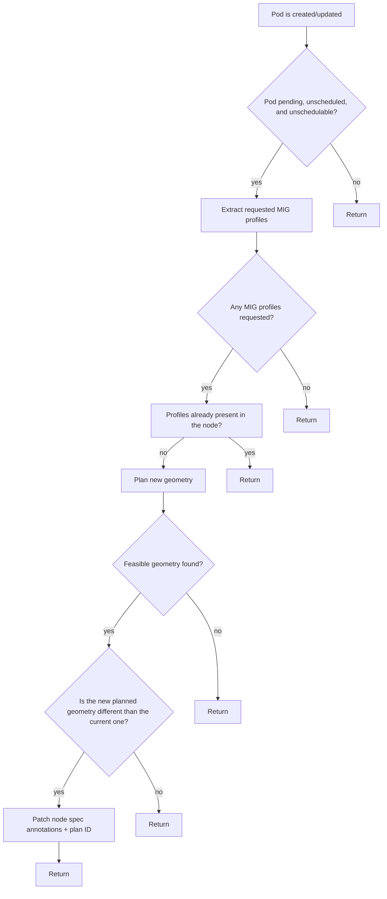
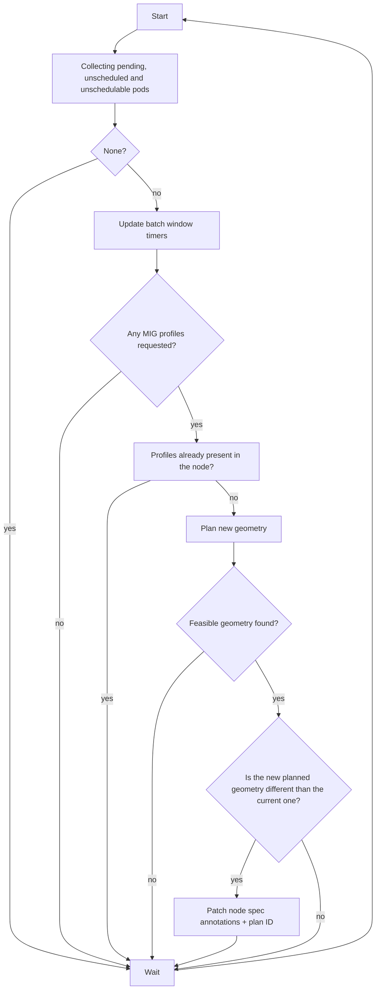
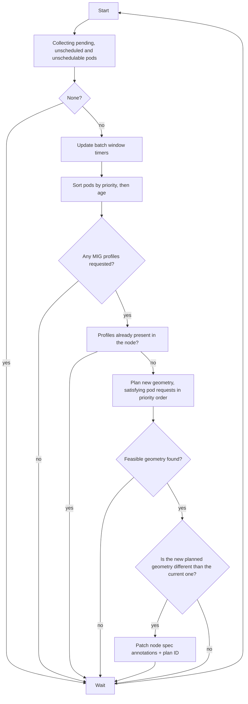

v1

```mermaid
flowchart TD
    1["Pod is created/updated"] --> 2{"Pod pending, unscheduled, and unschedulable?"}

    2 --"no"--> R1["Return"]
    2 --"yes"--> 3["Extract requested MIG profiles"]

    3 --> 4{"Any MIG profiles requested?"}
    4 --"no"--> R2["Return"]
    4 --"yes"--> 5["Profiles already present in the node?"]

    5 --"yes"--> R4["Return"]
    5 --"no"--> 6["Plan new geometry "]

    6 --> 7{"Feasible geometry found?"}

    7 --"no"--> R5["Return"]
    7 --"yes"--> 8{"Is the new planned geometry different than the current one?"}

    8 --"yes"--> 9["Patch node spec annotations + plan ID"]
    9 --> R6["Return"]

    8 --"no"--> R7["Return"]
```

v2

```mermaid
flowchart TD
    1["Start"] --> 2["Collecting pending, unscheduled and unschedulable pods"]
    2 --> 3{"None?"}

    3 --"yes"--> W["Wait"] --> 1
    3 --"no"-->4["Update batch window timers"]

    4 --> 5{"Any MIG profiles requested?"}

    5 --"no"--> W
    5 --"yes"--> 6["Profiles already present in the node?"]

    6 --"yes"--> W
    6 --"no"--> 7["Plan new geometry"]

    7-->8{"Feasible geometry found?"}

    8 --"no"--> W
    8 --"yes"--> 9{"Is the new planned geometry different than the current one?"}

    9 --"yes"--> 10["Patch node spec annotations + plan ID"]
    10--> W

    9 --"no"--> W
```
v3

```mermaid
flowchart TD
    1["Start"] --> 2["Collecting pending, unscheduled and unschedulable pods"]
    2 --> 3{"None?"}

    3 --"yes"--> W["Wait"] --> 1
    3 --"no"-->4.1["Update batch window timers"]

    4.1 -->4.2["Sort pods by priority, then age"]

    4.2 --> 5{"Any MIG profiles requested?"}

    5 --"no"--> W
    5 --"yes"--> 6["Profiles already present in the node?"]

    6 --"yes"--> W
    6 --"no"--> 7["Plan new geometry, satisfying pod requests in priority order"]

    7-->8{"Feasible geometry found?"}

    8 --"no"--> W
    8 --"yes"--> 9{"Is the new planned geometry different than the current one?"}

    9 --"yes"--> 10["Patch node spec annotations + plan ID"]
    10--> W

    9 --"no"--> W
```