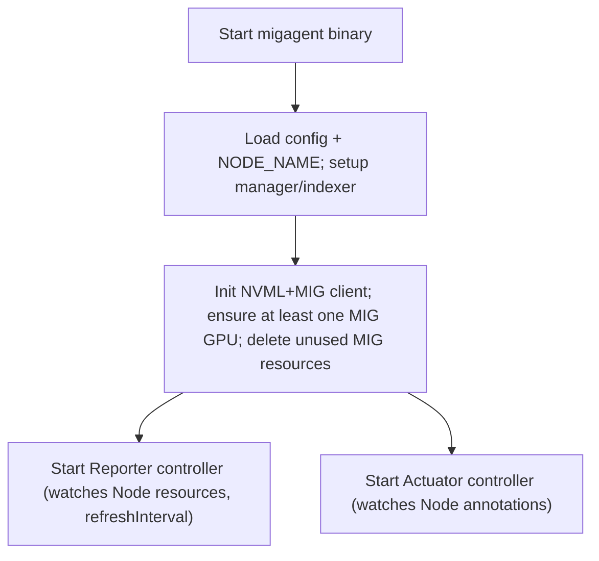
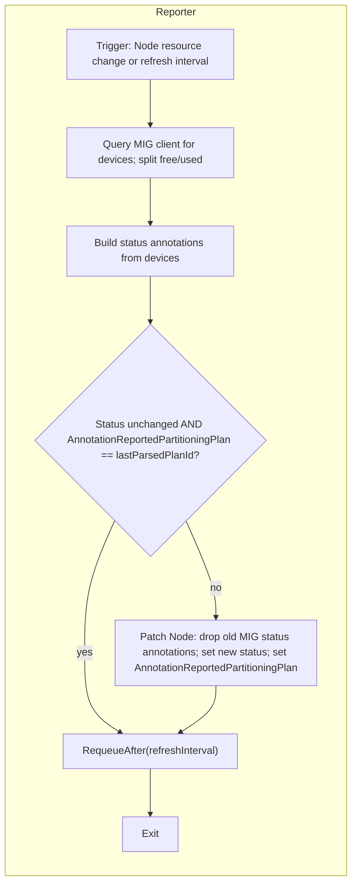
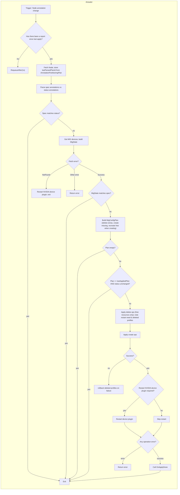

```mermaid
flowchart TD
Start["Start migagent binary"] --> Config["Load config + NODE_NAME; setup manager/indexer"]
Config --> Init["Init NVML+MIG client; ensure at least one MIG GPU; delete unused MIG resources"]
Init --> ReporterCtl["Start Reporter controller (watches Node resources, refreshInterval)"]
Init --> ActuatorCtl["Start Actuator controller (watches Node annotations)"]
```

```mermaid
flowchart TD
subgraph Reporter
direction TB
R0["Trigger: Node resource change or refresh interval"] --> R2["Query MIG client for devices; split free/used"]
R2 --> R3["Build status annotations from devices"]
R3 --> R4{"Status unchanged AND AnnotationReportedPartitioningPlan == lastParsedPlanId?"}
R4 -- yes --> R9["RequeueAfter(refreshInterval)"]
R4 -- no --> R5["Patch Node: drop old MIG status annotations; set new status; set AnnotationReportedPartitioningPlan"]
R5 --> R9
R9 --> R6["Exit"]
end
```

```mermaid
flowchart TD
subgraph Actuator
direction TB
A0["Trigger: Node annotation change"] --> A1{"Has there been a report since last apply?"}
A1 -- no --> A2["RequeueAfter(1s)"]
A1 -- yes --> A4["Fetch Node; store lastParsedPlanId from AnnotationPartitioningPlan"]
A4 --> A5["Parse spec annotations vs status annotations"]
A5 --> A6{"Spec matches status?"}
A6 -- yes --> A20["Exit"]
A6 -- no --> A7["Get MIG devices; build MigState"]
A7 --> A70{"Fetch error?"}
A70 -- NotFound --> A71["Restart NVIDIA device plugin; exit"]
A70 -- Other error --> A72["Return error"]
A70 -- Success --> A73{"MigState matches spec?"}
A73 -- yes --> A20
A73 -- no --> A9["Build MigConfigPlan (delete extras, create missing, recreate free when creating)"]
A9 --> A10{"Plan empty?"}
A10 -- yes --> A20
A10 -- no --> A11{"Plan == lastAppliedPlan AND status unchanged?"}
A11 -- yes --> A20
A11 -- no --> A12["Apply delete ops (free resources only); note restart need & deleted profiles"]
A12 --> A13["Apply create ops"]
A13 --> A131{"Success?"} 
A131 -- no --> A132["rollback deleted profiles on failure"]
A131 --yes--> A14{"Restart NVIDIA device plugin required?"}
A14 -- yes --> A15["Restart device plugin"]
A14 -- no --> A16["Skip restart"]
A15 --> A17{"Any operation error?"}
A16 --> A17
A17 -- error --> A18["Return error"]
A17 -- success --> A19["Call OnApplyDone"] --> A20
end
```